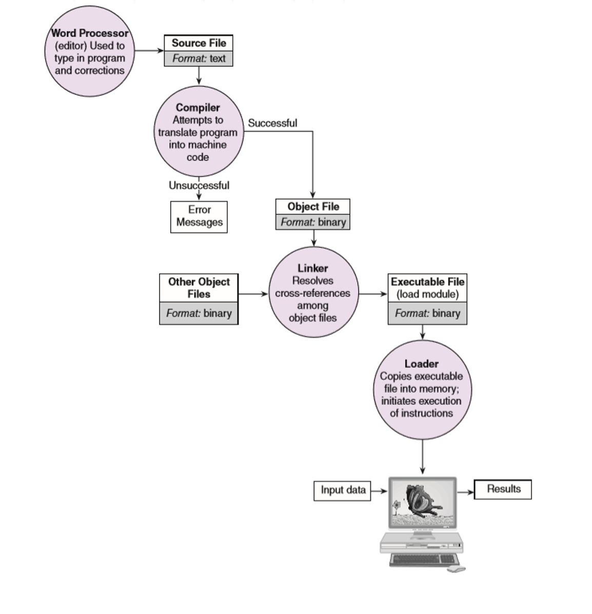
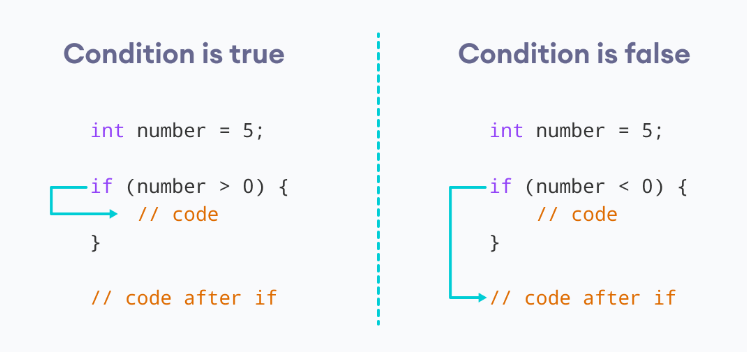
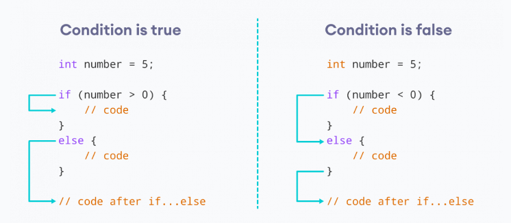
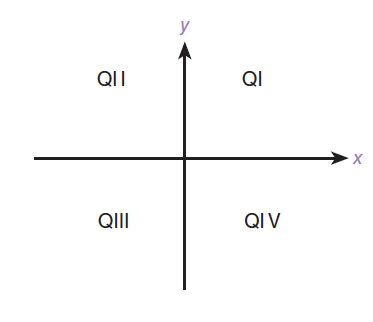

# 📘 Section 1 — Introduction to C

 > Your first steps into C programming — from writing and compiling code to variables, I/O, and conditional logic.

---

## 🎯 What You'll Learn

- How a C program is compiled and executed
- Program structure in C
- Output with `printf` and input with `scanf`
- Data types and variables
- Arithmetic and logical precedence
- Conditional statements (`if`, `else`, `switch`)

---

## 1. Program Execution Process

Before your code runs, it goes through several stages:

1. **Editor (Word Processor)** — You write your source code (text format)
2. **Compiler** — Attempts to translate your code to machine code (binary). If unsuccessful, it shows error messages
3. **Linker** — Resolves cross references among object files
4. **Loader** — Copies the executable file into memory and initiates execution



---

## 2. Program Structure in C

Every C program follows this basic structure:

```c
#include <stdio.h>    // Collection of pre-compiled functions

int main() {          // Main function, where program starts
    printf("Hello World\n");
    return 0;         // Returns with code 0 (meaning the program successfully closed)
}
```

| Part | Purpose |
|------|---------|
| `#include <stdio.h>` | Includes the standard I/O library (for `printf`, `scanf`, etc.) |
| `int main()` | The entry point of every C program |
| `return 0;` | Indicates successful execution |

---

## 3. Output with `printf`

`printf` is a function used to print output to the console.

```c
printf("Hello World\n");            // Simple text
printf("I am %d years old\n", 22); // With a format specifier
```

### Format Specifiers

| Specifier | Data Type |
|-----------|-----------|
| `%d` | Integer |
| `%f` | Float / Double |
| `%s` | String |
| `%c` | Character |

---

## 4. Data Types

| Data Type | Description | Size |
|-----------|-------------|------|
| `char` | Character | 1 byte |
| `int` | Integer | 4 bytes |
| `float` | Single-precision floating-point | 4 bytes |
| `double` | Double-precision floating-point | 8 bytes |
| `long long` | Long integer | 8 bytes |
| `unsigned int` | Unsigned integer | 4 bytes |

---

## 5. Variable Declaration and Initialization

```c
int n;      // Declaration
n = 10;     // Initialization
```

### The `sizeof()` Function

`sizeof()` returns the size of a data type. It can also be used with a variable.

```c
printf("Size of int: %zu\n", sizeof(int));

int n;
printf("Size of n: %d\n", sizeof(n));
```

> 💡 `%zu` is a format specifier used for `size_t` data type, but it is interchangeable with `%d` in this case.

---

## 6. Input with `scanf`

`scanf` is a function used to take input from user through the console.

```c
int n;
scanf("%d", &n);
printf("I am %d years old.\n", n);
```

> ⚠️ **Important:** Be careful when using `scanf` to read a variable. The `&` symbol must be used, which indicates "address".

---

## 7. Arithmetic and Logical Precedence

| Precedence | Operator | Description | Associativity |
|-----------|----------|-------------|---------------|
| 1 | `( )` | Parenthesis | Left to right |
| 2 | `*` `/` `%` | Multiplication, Division, Remainder | Left to right |
| 3 | `+` `-` | Addition, Subtraction | Left to right |
| 4 | `<` `<=` `>` `>=` | Relational Operators | Left to right |
| 5 | `==` `!=` | Equality Operators | Left to right |
| 6 | `&&` | Logical AND | Left to right |
| 7 | <code>&#124;&#124;</code> | Logical OR | Left to right |

### Examples on Precedence

```
1)  6 != 6 < 0 || 8 == 8 > 0 && 5 != 5
2)  6 != 2 * 3 || 5 * 2 && 8 % 8
3)  3 * 4 == 12 || 6 / 2 && 8 % 4
```

<details markdown="1">
<summary>🟢 Show Answers</summary>

**Expression 1:** `6 != 6 < 0 || 8 == 8 > 0 && 5 != 5`
- `6 < 0` → `0`, `8 > 0` → `1`
- `6 != 0` → `1`, `8 == 1` → `0`, `5 != 5` → `0`
- `0 && 0` → `0`
- `1 || 0` → **1**

**Expression 2:** `6 != 2 * 3 || 5 * 2 && 8 % 8`
- `2 * 3` → `6`, `5 * 2` → `10`, `8 % 8` → `0`
- `6 != 6` → `0`, `10 && 0` → `0`
- `0 || 0` → **0**

**Expression 3:** `3 * 4 == 12 || 6 / 2 && 8 % 4`
- `3 * 4` → `12`, `6 / 2` → `3`, `8 % 4` → `0`
- `12 == 12` → `1`, `3 && 0` → `0`
- `1 || 0` → **1**

</details>

---

## 8. Conditional Statements

### `if` Statement

```c
if (condition) {
    // your code
}
```



### A Tricky Example

```c
int age = 20;
int x = 3;
if (age > x)
    printf("inside");
printf("outside");
```

<details markdown="1">
<summary>🟢 What's the output?</summary>

```
insideoutside
```

Without curly braces `{}`, only the **first** statement after `if` is conditional. The second `printf` always runs.

> ⚠️ **Lesson:** Always use braces `{}` to avoid confusion.

</details>

### `if-else` Statement

```c
if (condition) {
    // body of if
} else {
    // body of else
}
```



### Nested `if` Statement

```c
if (condition1) {
    if (condition2) {
        // statements
    }
}
```

### `switch` Statement

```c
switch (expression) {
    case constant1:
        // code
        break;
    case constant2:
        // code
        break;
    default:
        // code
}
```

---

## 🧪 Exercises

---

### Exercise 1: Rectangle Area & Perimeter

**Task:** Design a program that accepts the length and width from the user and computes the perimeter and area of a rectangle.

<details markdown="1">
<summary>💡 Hint</summary>

- Area = length × width
- Perimeter = 2 × (length + width)
- Use `float` for the variables

</details>

<details markdown="1">
<summary>🟢 Click to Show Solution</summary>

```c
#include <stdio.h>

int main() {
    float l, w, area, perimeter;
    printf("Please enter the length: ");
    scanf("%f", &l);
    printf("Please enter the width: ");
    scanf("%f", &w);
    area = l * w;
    perimeter = (l + w) * 2;
    printf("Area = %f\nPerimeter = %f\n", area, perimeter);
    return 0;
}
```

</details>

---

### Exercise 2: Celsius to Fahrenheit

**Task:** Write a program that takes degrees centigrade from the user and displays the same temperature in degrees Fahrenheit. The formula is: `Fahrenheit = 9/5 × Centigrade + 32`

<details markdown="1">
<summary>💡 Hint</summary>

- Be careful with integer division! `9/5` in C gives `1`, not `1.8`
- Use `9 / 5.0` to force floating-point division

</details>

<details markdown="1">
<summary>🟢 Click to Show Solution</summary>

```c
#include <stdio.h>

int main() {
    float c, f;
    printf("Enter temperature in degrees Centigrade: ");
    scanf("%f", &c);

    f = 9 / 5.0 * c + 32;

    printf("Temperature in degrees Fahrenheit: %.3f\n", f);

    return 0;
}
```

> ⚠️ **Why `5.0` and not `5`?** In C, dividing two integers performs integer division. `9 / 5` gives `1`. Writing `5.0` makes it a float, so `9 / 5.0` correctly gives `1.8`.

</details>

---

### Exercise 3: Trace the Code

**Trace the following code and determine the output.**

**Part A:**

```c
int a = 3, b = -5, c;
if (a < 2 * b) {
    b = a;
    c = b;
    printf("%d\n", c);
} else if (b > 0)
    b = 0;
printf("%d\n", b);
```

<details markdown="1">
<summary>🟢 Show Answer — Part A</summary>

**Output:**

```
-5
```

**Trace:**
- `a = 3`, `b = -5`
- `a < 2 * b` → `3 < -10` → **false**
- `b > 0` → `-5 > 0` → **false**
- Neither block runs, `b` stays `-5`
- `printf("%d\n", b)` prints `-5`

</details>

**Part B:**

```c
int k, x, a;
k = 0;
a = 5;
if (k = 0)           // NOTE: This is assignment, not comparison!
    if (a > 0) {
        x = a + k;
        printf("a= %d k= %d x= %d \n", a, k, x);
    } else {
        a = k + 1;
        k = a + 1;
    }
else {
    if (a < 0)
        x = a + 1;
    else
        x = a - 1;
    printf("a= %d k= %d x= %d \n", a, k, x);
}
printf("a= %d k= %d \n", a, k);
```

<details markdown="1">
<summary>🟢 Show Answer — Part B</summary>

**Output:**

```
a= 5 k= 0 x= 4 
a= 5 k= 0 
```

**Trace:**
- `k = 0`, `a = 5`
- `if (k = 0)` — this is **assignment**, not comparison! It assigns `0` to `k`, and `0` is **false** in C
- So the `else` block runs
- `a < 0` → `5 < 0` → **false**, so `x = a - 1` → `x = 4`
- Prints `a= 5 k= 0 x= 4`
- Then prints `a= 5 k= 0`

> ⚠️ **Classic trap:** `k = 0` (assignment) vs `k == 0` (comparison).

</details>

---

### Exercise 4: Simple Calculator

**Task:** Write a program to input two numbers from the user and display their arithmetic results (`+`, `-`, `*`, `/`, `%`).

<details markdown="1">
<summary>💡 Hint</summary>

- Handle **division by zero**
- Use `(float)n1 / n2` for decimal division (type casting)
- To print `%` in `printf`, use `%%`

</details>

<details markdown="1">
<summary>🟢 Click to Show Solution</summary>

```c
#include <stdio.h>

int main() {
    int n1, n2;
    printf("Enter the first number: ");
    scanf("%d", &n1);
    printf("Enter the second number: ");
    scanf("%d", &n2);

    printf("Addition: %d + %d = %d\n", n1, n2, n1 + n2);
    printf("Subtraction: %d - %d = %d\n", n1, n2, n1 - n2);
    printf("Multiplication: %d * %d = %d\n", n1, n2, n1 * n2);

    if (n2 != 0) {
        printf("Division: %d / %d = %f\n", n1, n2, (float)n1 / n2);
        printf("Modulus: %d %% %d = %d\n", n1, n2, n1 % n2);
    } else {
        printf("Division by zero is not possible.\n");
    }

    return 0;
}
```

**Key concepts:**
- `(float)n1 / n2` — **type casting** forces floating-point division
- `%%` in `printf` — prints a literal `%` symbol
- Always check `n2 != 0` before dividing

</details>


### Exercise 5: Cartesian Plane Quadrant

**Task:** Accept the x-y coordinates of a point in the Cartesian plane and print a message telling either an axis on which the point lies or the quadrant in which it is found.



**Sample outputs:**

```
(-1.0, -2.5) is in quadrant III
(0, 4.8) is on the y-axis
```

<details markdown="1">
<summary>💡 Hint</summary>

- If both x and y are 0 → origin
- If x is 0 → y-axis
- If y is 0 → x-axis
- Otherwise, check signs to determine the quadrant (I through IV)

</details>

<details markdown="1">
<summary>🟢 Click to Show Solution</summary>

```c
#include <stdio.h>

int main() {
    double x, y;
    printf("Enter the x coordinate: ");
    scanf("%lf", &x);
    printf("Enter the y coordinate: ");
    scanf("%lf", &y);

    if (x == 0 && y == 0) {
        printf("(0,0) is at the origin");
    } else if (x == 0) {
        printf("(0,%.1f) is on the y-axis", y);
    } else if (y == 0) {
        printf("(%.1f,0) is on the x-axis", x);
    } else if (x > 0 && y > 0) {
        printf("(%.1f,%.1f) is in quadrant I", x, y);
    } else if (x < 0 && y > 0) {
        printf("(%.1f,%.1f) is in quadrant II", x, y);
    } else if (x < 0 && y < 0) {
        printf("(%.1f,%.1f) is in quadrant III", x, y);
    } else if (x > 0 && y < 0) {
        printf("(%.1f,%.1f) is in quadrant IV", x, y);
    }

    return 0;
}
```

> 💡 **Key idea:** Check the special cases (origin, axes) **before** checking quadrants. Use `%lf` in `scanf` for `double`.

</details>

---

> ⬅️ [Back to Home](index.html)
